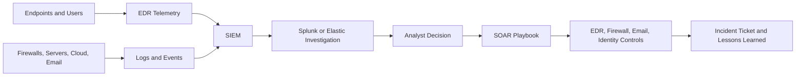

# 🛡️ Core SOC Solutions

A learning module covering the core technologies used by Security Operations Center (SOC) analysts: Endpoint Detection and Response (EDR), Security Information and Event Management (SIEM), security analytics platforms, and Security Orchestration, Automation, and Response (SOAR).

## 🎯 Learning Objectives

By completing this module, I developed an understanding of how SOC teams:

- Monitor endpoints, identities, networks, and applications.
- Centralize and search security logs.
- Investigate suspicious activity and identify indicators of compromise.
- Correlate events to detect attacks that span multiple systems.
- Automate repetitive response actions through playbooks.
- Improve incident response using evidence-based workflows.

## 🗺️ Module Roadmap

| Topic | Main Focus | Practical SOC Value |
| :--- | :--- | :--- |
| **Introduction to EDR** | Endpoint visibility and response | Detect suspicious processes, persistence, malware, and abnormal behavior |
| **Introduction to SIEM** | Centralized security monitoring | Correlate logs and generate alerts across an environment |
| **Splunk: The Basics** | Log search and investigation | Query events, build investigations, and identify attack patterns |
| **Elastic Stack: The Basics** | ELK-based security analysis | Collect, visualize, and investigate security telemetry |
| **Introduction to SOAR** | Orchestration and automation | Execute repeatable response playbooks and reduce analyst workload |

---

## 📑 Detailed Topics

### 1. Introduction to EDR

**Endpoint Detection and Response** protects and monitors devices such as workstations, laptops, and servers.

#### Core Functions

- Collect process, file, network, registry, login, and command-line activity.
- Detect malware, suspicious scripts, credential theft, and abnormal behavior.
- Show process relationships and parent-child execution chains.
- Investigate endpoint timelines and indicators of compromise.
- Support response actions such as host isolation, process termination, and file quarantine.

#### Important Telemetry

- A user application spawning PowerShell or a command shell.
- Office applications creating scripts or executable files.
- Unusual outbound connections from a workstation.
- New scheduled tasks, services, registry run keys, or startup entries.
- Suspicious file hashes, paths, command lines, and digital signatures.

#### SOC Investigation Workflow

1. Review the alert and affected endpoint.
2. Examine the process tree and command line.
3. Identify the user, parent process, file path, and destination.
4. Search for the same indicator across other endpoints.
5. Contain the host if the activity is confirmed malicious.
6. Remove the threat, restore the endpoint, and document the findings.

---

### 2. Introduction to SIEM

A **Security Information and Event Management** platform collects and analyzes logs from many sources in one location.

#### Core Functions

- Ingest logs from endpoints, firewalls, servers, cloud services, applications, and identity providers.
- Normalize events into a searchable format.
- Correlate related events across different systems.
- Generate alerts based on detection rules and behavioral patterns.
- Provide dashboards, reports, timelines, and investigation tools.

#### Common SIEM Data Sources

- Windows Security Event Logs
- Linux authentication and system logs
- Firewall and proxy logs
- DNS queries
- VPN and identity-provider events
- Cloud audit logs
- EDR alerts
- Web server and database logs

#### Example Detection Scenario

A SIEM may correlate a failed login burst, a successful login from an unusual location, and a new administrative action. Individually, these events may appear normal or low risk, but together they may indicate account compromise.

#### SOC Value

SIEM gives analysts centralized visibility, making it easier to establish a timeline, connect events from different systems, prioritize alerts, and preserve evidence for incident response.

---

### 3. Splunk: The Basics

**Splunk** is a platform used to collect, index, search, and visualize machine-generated data.

#### Basic Investigation Concepts

- **Index:** A location where event data is stored.
- **Source:** The origin of the event, such as a firewall, endpoint, or server.
- **Sourcetype:** A classification that describes the event format.
- **Field:** A searchable value such as username, source IP, destination port, or event ID.
- **SPL:** Splunk Processing Language, used to search and analyze events.

#### Example Defensive Searches

```text
index=security EventCode=4625
| stats count by Account_Name, Source_Network_Address
| sort - count
```

This type of search can help identify repeated failed Windows logons by account and source address.

```text
index=edr process_name IN ("powershell.exe", "cmd.exe", "wscript.exe")
| stats count by host, user, parent_process
```

This can help analysts identify command interpreters launched on endpoints and determine whether their parent processes are suspicious.

> Search syntax varies by data model and deployment. The examples are for defensive investigation and should be adapted to the available fields.

---

### 4. Elastic Stack: The Basics

The **Elastic Stack**, commonly called **ELK**, is a collection of tools used for data collection, indexing, searching, visualization, and security analysis.

| Component | Role |
| :--- | :--- |
| **Beats / Elastic Agent** | Collect and forward logs and telemetry |
| **Logstash** | Process, transform, and route event data |
| **Elasticsearch** | Store and search indexed events |
| **Kibana** | Visualize data, investigate events, and build dashboards |

#### SOC Investigation Uses

- Search authentication events and endpoint activity.
- Build dashboards for failed logins, suspicious processes, and network connections.
- Filter events by host, user, IP address, timestamp, or event category.
- Create detection rules for unusual behavior.
- Correlate endpoint, network, and identity events in one investigation view.

#### Example Query Concept

An analyst could search for repeated authentication failures followed by a successful login from the same source address, then review the user, device, geographic location, and subsequent activity.

---

### 5. Introduction to SOAR

**Security Orchestration, Automation, and Response** platforms connect security tools and automate repeatable incident-response tasks.

#### Orchestration

Orchestration connects tools such as the SIEM, EDR, email gateway, threat-intelligence platform, ticketing system, and firewall.

#### Automation

Automation performs predefined actions when an alert meets specific conditions, reducing manual work and improving response speed.

#### Example Phishing Playbook

1. Receive a suspicious-email alert from the SIEM.
2. Extract the sender, recipients, URLs, domains, and attachments.
3. Check the indicators against threat-intelligence sources.
4. Search for matching messages in other mailboxes.
5. Quarantine confirmed malicious messages.
6. Block the malicious domain or URL using approved controls.
7. Create or update an incident ticket.
8. Notify the security team and document the final result.

#### Safety Controls

Automated actions should use approval gates, scope limits, logging, rollback procedures, and clear conditions. High-impact actions such as disabling accounts, isolating critical servers, or blocking business-critical domains should require additional validation.

---

## 🔄 How the SOC Solutions Work Together



A typical SOC workflow begins with telemetry generated by endpoints and infrastructure. EDR and other security controls send events to a SIEM, where alerts are correlated and prioritized. Analysts investigate the evidence in platforms such as Splunk or Elastic, while SOAR can automate approved containment, notification, and documentation steps.

## 🧠 Key Takeaways

- **EDR** provides detailed visibility into endpoint behavior.
- **SIEM** centralizes and correlates security events.
- **Splunk** supports log searching and investigation through SPL.
- **Elastic Stack** provides scalable collection, indexing, search, and visualization.
- **SOAR** connects tools and automates repeatable response actions.
- Effective SOC operations depend on accurate telemetry, sound investigation, documented decisions, and carefully controlled automation.

## ✅ Completion Status

- [x] Introduction to EDR
- [x] Introduction to SIEM
- [x] Splunk: The Basics
- [x] Elastic Stack: The Basics
- [x] Introduction to SOAR
