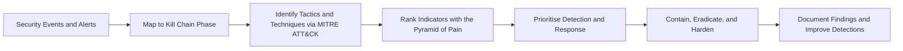

# 🛡️ Cyber Defence Frameworks

A learning module covering the defensive frameworks used by Security Operations Center (SOC) analysts to understand and counter adversarial behaviour: the Pyramid of Pain, the Cyber Kill Chain, the Unified Kill Chain, and MITRE ATT&CK, along with two hands-on challenges that apply these concepts in practice.

## 🎯 Learning Objectives

By completing this module, I developed an understanding of how SOC teams:

- Model adversarial behaviour using established defensive frameworks.
- Rank indicators of compromise by how costly they are for an adversary to change.
- Identify and prevent network intrusions by mapping attacks to kill chain phases.
- Correlate attacker tactics and techniques across environments using MITRE ATT&CK.
- Prioritise detection and response based on framework-driven analysis.
- Harden detection, triage, and response workflows.

## 🗺️ Module Roadmap

| Topic | Main Focus | Practical SOC Value |
| :--- | :--- | :--- |
| **Pyramid of Pain** | Ranking indicators by adversary cost | Prioritise detections that are hardest for attackers to change |
| **Cyber Kill Chain** | Phases of a network intrusion | Break the attack at its earliest stage and track its progress |
| **Unified Kill Chain** | Combined Kill Chain and ATT&CK model | Map complex, looping attacks across all phases and cycles |
| **MITRE** | ATT&CK tactics, techniques, and resources | Standardise adversary behaviour and find detection coverage gaps |
| **Summit** | Applied Pyramid of Pain simulation | Chase a simulated adversary from hashes up to TTPs |
| **Eviction** | Detection and response scenario | Exercise triage and eviction in a simulated environment |

---

## 📑 Detailed Topics

### 1. Pyramid of Pain

The **Pyramid of Pain** is a model that ranks indicators of compromise (IOCs) by how difficult and costly it is for an adversary to change them. The higher up the pyramid a defender can detect and respond, the harder the attacker must work to adapt.

#### The Levels

| Level | Example | Adversary Cost to Change |
| :--- | :--- | :--- |
| **Hash values** | MD5, SHA1, SHA256 of a file | Trivial — changing one byte changes the hash |
| **IP addresses** | Command-and-control server IP | Easy — rotate IPs or use VPNs and proxies |
| **Domain names** | Malicious domain | Easy — register a new domain |
| **Host artifacts** | Registry keys, scheduled tasks, services, mutexes | Annoying — requires reworking tools |
| **Network artifacts** | URI patterns, user-agent strings, C2 protocols | Annoying — requires reworking tools |
| **Tools** | Specific malware and utilities used | Challenging — must develop or obtain new tools |
| **TTPs** | Tactics, techniques, and procedures | Very painful — requires changing behaviour entirely |

#### Defensive Application

- Detecting on hashes or IPs alone is fragile because attackers change them constantly.
- Mature detection aims for the tools and TTP levels, forcing the adversary to fundamentally change their approach.
- The model guides response prioritisation: respond to everything, but invest most in the indicators that are hardest to replace.

---

### 2. Cyber Kill Chain

The **Cyber Kill Chain**, developed by Lockheed Martin, models the stages of a network intrusion and is used to identify and prevent intrusions. Defenders map detections to each stage to determine how far an attack has progressed and where to break the chain.

#### The Seven Phases

1. **Reconnaissance** — the attacker researches the target.
2. **Weaponization** — coupling an exploit with a payload.
3. **Delivery** — transmitting the weapon to the target (phishing, USB, drive-by).
4. **Exploitation** — triggering the exploit to execute code.
5. **Installation** — installing persistence such as malware or a backdoor.
6. **Command & Control (C2)** — establishing remote control of the host.
7. **Actions on Objectives** — achieving the goal (data theft, ransomware, destruction).

#### Defensive Application

- Each phase is an opportunity to detect, deny, disrupt, degrade, or deceive the attacker.
- Stopping an attack early, such as blocking the phishing email at the Delivery phase, prevents the later phases entirely.
- The model gives a SOC a common language for describing intrusions, such as "detected at the Exploitation phase".

---

### 3. Unified Kill Chain

The **Unified Kill Chain** combines the Cyber Kill Chain with MITRE ATT&CK into a single, more detailed model. It establishes the phases of an attack and a means of identifying and mitigating risk to IT assets, addressing the classic Kill Chain's limitation that real attacks rarely follow a single linear path.

#### The 18 Phases (3 Cycles)

**Cycle 1 — "In" (Initial Foothold):** Reconnaissance → Weaponization → Delivery → Social Engineering → Exploitation → Persistence → Defense Evasion → Command & Control → Pivoting

**Cycle 2 — "Through" (Network Propagation):** Discovery → Privilege Escalation → Execution → Credential Access → Lateral Movement

**Cycle 3 — "Out" (Action on Objectives):** Collection → Exfiltration → Impact → Objectives

#### Defensive Application

- Attackers loop between phases rather than marching forward, and the cyclic structure reflects that.
- Mapping to both the Kill Chain and ATT&CK provides a complete picture and a checklist for hunting and mitigation at every stage.

---

### 4. MITRE

**MITRE** publishes open resources for the cybersecurity community. This topic focuses on MITRE ATT&CK and the supporting tools built around it.

#### Key Resources

| Resource | Purpose |
| :--- | :--- |
| **MITRE ATT&CK** | Knowledge base of real-world adversary behaviour organised into tactics and techniques |
| **ATT&CK Navigator** | Interactive tool to visualise an organisation's coverage of ATT&CK techniques |
| **CAR** | Cyber Analytics Repository of analytics and detection behaviours mapped to ATT&CK |
| **Engage** | Framework for adversary engagement, denial, and deception |

#### Defensive Application

- ATT&CK is the de facto standard for describing adversary behaviour in a SOC.
- Analysts map alerts to techniques, identify coverage gaps, and write better detections.
- Detecting at the technique level, near the top of the Pyramid of Pain, is far more effective than chasing hashes.

---

### 5. Summit

**Summit** is a hands-on scenario that applies the Pyramid of Pain end-to-end: chasing a simulated adversary up the pyramid by pivoting from low-level indicators such as hashes and IPs toward higher-level indicators such as artifacts, tools, and TTPs until the adversary backs down.

#### What It Reinforced

- Low-level indicators are easy to collect but easy for the adversary to change.
- The higher the detection climbs the pyramid, the harder the adversary must work.
- Structured pivoting turns isolated indicators into a coherent hunt.

---

### 6. Eviction

**Eviction** is a challenge that exercises detection and response skills in a simulated compromised environment. It ties the frameworks together by recognising where an adversary sits in the kill chain and acting to evict them.

#### What It Reinforced

- Framework knowledge becomes actionable when mapped to a live scenario.
- Identifying the kill chain phase of an activity informs urgency and response.
- Effective eviction depends on clean triage, containment, and documentation.

---

## 🔄 How the Frameworks Work Together

A typical defensive workflow begins with a security event or alert. The analyst maps the activity to a kill chain phase to understand how far the attack has progressed, then identifies the associated tactics and techniques using MITRE ATT&CK. The Pyramid of Pain ranks the observed indicators by adversary cost, which guides prioritisation: detections based on tools and TTPs are favoured over fragile hash- and IP-level indicators. The team then contains and eradicates the threat, hardens the environment, and documents the findings to strengthen future detections.

## 🧠 Key Takeaways

- **Pyramid of Pain** ranks indicators by how costly they are for an adversary to change.
- **Cyber Kill Chain** breaks an intrusion into phases, each an opportunity to stop the attack.
- **Unified Kill Chain** merges the Kill Chain with ATT&CK into a cyclic, more complete model.
- **MITRE ATT&CK** standardises adversary tactics and techniques and reveals detection coverage gaps.
- **Summit** and **Eviction** reinforce the framework concepts through hands-on application.
- Strong detection focuses on behaviours and TTPs rather than only hashes and IPs.

## 💼 Skills Gained

| Area | Skill |
| :--- | :--- |
| **Frameworks** | Explain and differentiate the Pyramid of Pain, Cyber Kill Chain, Unified Kill Chain, and MITRE ATT&CK |
| **Indicators** | Rank indicators of compromise by adversary cost and prioritise detection accordingly |
| **Mapping** | Map alerts and attacks to kill chain phases and ATT&CK tactics and techniques |
| **Tooling** | Familiarity with ATT&CK Navigator and the CAR knowledge base |
| **Mindset** | Shifted from reactive, hash-level detection toward behaviour- and TTP-level defence |

## 📝 Personal Reflection

> The framework that stood out to me most was **[Pyramid of Pain / Cyber Kill Chain / Unified Kill Chain / MITRE]** because **[reason]**. It changed how I look at an alert as a SOC L1 analyst — instead of chasing **[hashes and IPs]**, I now think about **[tactics and techniques]**. I can also read an alert and ask "**[which kill chain phase]** are we seeing?" to judge how urgent it is. Next, I want to keep practising with **[MITRE ATT&CK Navigator / a SIEM such as Splunk / more TryHackMe SOC rooms]** to turn these concepts into everyday habits.

## ✅ Completion Status

- [x] Pyramid of Pain
- [x] Cyber Kill Chain
- [x] Unified Kill Chain
- [x] MITRE
- [x] Summit
- [x] Eviction
