# 🌐 Network Traffic Analysis

A learning module covering how Security Operations Center (SOC) analysts capture, inspect, and interpret data as it flows across a network: what network traffic analysis is and why it matters, how traffic is collected, packet-level investigation with Wireshark, anomaly detection across common protocols, and artefact extraction for network forensics with NetworkMiner.

## 🎯 Learning Objectives

By completing this module, I developed an understanding of how SOC teams:

- Explain what network traffic analysis is, why it is essential, and how it differs from simply running a packet capture tool.
- Identify which traffic can be observed, from packet headers and payloads to the fields that application, firewall, and flow logs do and do not retain.
- Select the appropriate collection method and source: full packet capture, flow statistics, log telemetry, SPAN ports, network TAPs, or host-based capture.
- Navigate captures in Wireshark, read a packet layer by layer, and profile a capture with statistics before diving into packets.
- Isolate relevant traffic using capture filters, display filters, and packet operations such as following streams and exporting objects.
- Recognise anomalous and malicious patterns, including port scans, ARP poisoning, tunnelling, and cleartext credential exposure.
- Reconstruct activity from a capture by extracting hosts, sessions, credentials, and files, and correlate packet evidence with other telemetry.

## 🗺️ Module Roadmap

| Topic | Main Focus | Practical SOC Value |
| :--- | :--- | :--- |
| **Network Traffic Basics** | Purpose, observability, and collection of network traffic | Know what to capture, where from, and which tool answers which question |
| **Wireshark: The Basics** | Wireshark interface and packet structure | Navigate a capture and read a packet layer by layer |
| **Wireshark: Packet Operations** | Display filters and packet-level investigation | Reduce a large capture to the packets that actually matter |
| **Wireshark: Traffic Analysis** | Anomalies and patterns across protocols | Spot scans, poisoning, and tunnelling on a real network |
| **NetworkMiner** | Network forensics and artefact extraction | Recover hosts, sessions, credentials, and files without reading every packet |

---

## 📑 Detailed Topics

### 1. Network Traffic Basics

**Network Traffic Basics** defines network traffic analysis (NTA) as the process of capturing, inspecting, and analysing data as it flows across a network, with the goal of achieving complete visibility into what is communicated inside and outside the perimeter. The room makes the important point up front that NTA is not a synonym for Wireshark: it is the combination of correlating several logs, deep packet inspection, and network flow statistics against a defined objective.

#### Why Traffic Is Analysed

| Use Case | What It Provides |
| :--- | :--- |
| **Visibility** | A record of what actually left and entered the network, independent of what a host claims |
| **Alert investigation** | Packet-level confirmation of what a detection actually saw, reducing false positives |
| **Threat hunting** | Proactive searching for patterns not yet covered by existing detections |
| **Incident response** | Evidence of exfiltration, command and control, and lateral movement |
| **Baselining** | A definition of normal that makes the abnormal visible |

#### What Can Be Observed

| Layer | Observable Evidence | Analyst Note |
| :--- | :--- | :--- |
| **Link** | MAC addresses, ARP | Foundation for detecting spoofing at layer 2 |
| **Network** | Source and destination IPs, TTL, fragmentation | Fragmentation can split payloads so no single packet looks malicious |
| **Transport** | Ports, TCP flags, sequence and acknowledgement numbers | **Sequence numbers** are how session hijacking is detected — a sudden jump warrants investigation |
| **Application** | Payload content: HTTP requests, DNS queries, cleartext credentials | Where the richest evidence lies when encryption is absent |

#### Collection Methods

| Method | Advantages | Trade-offs |
| :--- | :--- | :--- |
| **Full packet capture** | Complete detail including payload, sequence numbers, and timing (Wireshark, `tcpdump`, `TShark`, Snort, Suricata, Zeek) | Storage- and performance-heavy; retention usually short |
| **Flow statistics** | Lightweight metadata: IPs, ports, byte and packet counts, duration | No payload, but long retention and good for trending |
| **Log telemetry** | Firewall, IDS/IPS, DNS, and proxy logs providing context and history | Often omits payload and detailed header fields |
| **Host-based capture** | Traffic as seen by the endpoint, useful when the network is encrypted end to end | Limited to one host's view |

#### Defensive Application

- Correlating DNS logs with packet evidence shows how a single query links a query name, query type, subdomain and top-level domain, the host IP that asked, the destination IP, and a timestamp — which together build a timeline of suspicious activity.
- Reputation lookups on those extracted fields turn a raw query into a verdict, using services such as AbuseIPDB, abuse.ch, and VirusTotal.
- Firewall logs show source and destination ports and flags but usually not payload or sequence numbers, which is precisely why full packet capture remains necessary for certain classes of attack.
- Collection method is a design decision: full packet capture for depth, flow data for breadth and retention, logs for context.

---

### 2. Wireshark: The Basics

**Wireshark: The Basics** moves from concepts to the tool itself: the interface layout, how to capture and open traffic, how a packet is structured, and how to navigate a capture efficiently instead of scrolling through thousands of frames.

#### The Interface

| Area | Purpose |
| :--- | :--- |
| **Capture vs display filter bar** | Capture filters decide what is recorded; display filters decide what is shown |
| **Packet list pane** | One row per frame, with columns for time, source, destination, protocol, length, and info |
| **Packet details pane** | The dissected protocol tree for the selected frame |
| **Packet bytes pane** | The raw hex and ASCII view of the frame |
| **Status bar and profile indicator** | Capture source, applied filters, and the active configuration profile |

#### Working with Captures

| Task | Method |
| :--- | :--- |
| **Start capturing** | Select the interface and begin capture, with promiscuous mode and capture filters configured beforehand |
| **Open existing traffic** | Load a `.pcap` or `.pcapng` file, including sample captures bundled with the tool |
| **Profile a capture** | Statistics menu: Capture File Properties, Protocol Hierarchy, Conversations, Endpoints, IO Graph |
| **Navigate** | Go to packet, Find Packet by string, hex, or regular expression; mark, ignore, and comment on frames |
| **Read a packet** | Expand the dissection tree from frame to Ethernet to IP to transport to application, reading encapsulation from the outside in |

#### Defensive Application

- Profiling a capture before reading packets shows which protocols dominate it and which conversations carry the most traffic — the fastest route to an interesting frame.
- Custom columns (source port, destination port, protocol, or a specific field) turn the packet list into a purpose-built view for the investigation at hand.
- Display filters can be generated by dragging a field out of the dissection pane, which removes guesswork from filter syntax.
- Time display formats and relative timestamps convert a packet list into a timeline, which is the form the finding has to be reported in.

---

### 3. Wireshark: Packet Operations

**Wireshark: Packet Operations** is the room about precision: the display filter language in depth, packet-level operations for reconstructing what happened, and the statistics that summarise a capture. The stated goal is finding the needle in the haystack.

#### Filter Fundamentals

| Element | Examples | Notes |
| :--- | :--- | :--- |
| **Comparison operators** | `==`, `!=`, `>`, `<`, `>=`, `<=` | Compare a field against a value |
| **Logical operators** | `and` / `&&`, `or` / `\|\|`, `not` / `!` | Combine conditions |
| **Membership** | `tcp.port in {80 443 8080}` | Test a field against a set of values |
| **Slices** | `eth.src[0:3] == 00:0c:29` | Compare part of a field, useful for vendor prefixes |
| **Substring match** | `http.host contains "example"` | Case-sensitive substring search inside a field |
| **Regular expression** | `http.request.uri matches "\\.(exe\|dll)$"` | Pattern matching for flexible searches |

#### Common Filter Targets

| Purpose | Filter |
| :--- | :--- |
| **Host traffic** | `ip.addr == 10.10.10.5`, `ip.src ==`, `ip.dst ==` |
| **Port or service** | `tcp.port == 22`, `udp.port == 53` |
| **TCP flags** | `tcp.flags.syn == 1`, `tcp.flags.reset == 1` |
| **HTTP requests** | `http.request.method == "POST"`, `http.host ==`, `http.user_agent contains` |
| **DNS queries** | `dns.qry.name ==`, `dns.qry.name.len > 40` |
| **TLS metadata** | `tls.handshake.extensions_server_name` |
| **Payload content** | `tcp contains "password"`, `frame contains "SELECT"` |

#### Packet Operations

| Operation | Purpose |
| :--- | :--- |
| **Follow stream** | Reconstruct an entire TCP, HTTP, or TLS conversation into readable form |
| **Export objects** | Recover files transferred over HTTP, SMB, TFTP, and similar protocols |
| **Apply / Prepare as filter** | Build filters directly from a selected field or value |
| **Statistics** | Capture File Properties, Protocol Hierarchy, Conversations, Endpoints, and protocol-specific statistics |
| **Find Packet** | Search the capture by string, hex value, or regular expression |
| **Mark, ignore, and comment** | Annotate the investigation and temporarily hide noise |

#### Defensive Application

- Filters should be built incrementally, validating each condition before adding the next, so a wrong result can be traced to the specific clause that caused it.
- Following a stream is often faster than reading individual packets when the question is "what did this session actually do?".
- Exporting objects recovers the payload of a transfer — the artefact that matters for evidence and hashing — without relying on the endpoint that received it.
- Statistics first, filters second: profiling the capture identifies the conversations worth filtering before any filter is written.

---

### 4. Wireshark: Traffic Analysis

**Wireshark: Traffic Analysis** applies the tooling to detection: recognising what scans, attacks, and tunnelling look like on the wire, and building the baseline of normal traffic that makes anomalies visible.

#### Patterns Investigated

| Pattern | What It Looks Like in a Capture |
| :--- | :--- |
| **TCP connect scan** | Full three-way handshake completed for every port, larger window size, complete TCP options — the host itself is building the requests. |
| **SYN scan** | Half-open connections: SYN, SYN/ACK, then an immediate RST. Smaller window size and minimal TCP options, because the tool is crafting packets directly. |
| **UDP scan** | No handshake at all; an ICMP port-unreachable error indicates a closed port, and the ICMP payload encapsulates the original request for correlation. |
| **ARP poisoning / MITM** | Duplicate address detection, an unexpected MAC claiming a known IP, and gratuitous ARP traffic — traffic addressed to a gateway that physically reaches the wrong MAC. |
| **Host identification** | DHCP options revealing hostnames and requested addresses, NetBIOS name service lookups, and Kerberos identifiers exposing usernames and service accounts. |
| **ICMP tunnelling** | Unusually large ICMP payloads carrying encapsulated protocol data (an entire protocol session inside ping packets). |
| **DNS tunnelling** | Long, high-entropy subdomains and repeated queries to a single domain, with data encoded into the query name itself. |

#### What Anomalies Look Like

An anomaly is a deviation from the established baseline, and network traffic gives several dimensions to measure it against:

- **Volume** — one host generating an order of magnitude more connections than its peers.
- **Breadth** — sequential or near-sequential destination ports, characteristic of scanning.
- **Size** — payloads that do not match what the protocol normally carries.
- **Timing** — beaconing at regular intervals, or activity at hours that contradict normal usage.
- **Direction** — large volumes leaving the network rather than entering it.
- **Peer** — conversations with infrastructure that the host has never contacted before.

#### Defensive Application

- Scan detection depends on knowing how each scan type is constructed, because the tell is in the flags, window size, and TCP options rather than in the destination ports alone.
- ARP poisoning is invisible at the IP layer — it is detected by looking at MAC addresses, which is why a MAC column belongs in any investigation of internal traffic.
- Cleartext protocols are a forensic gift and an operational hazard: credentials submitted over FTP, HTTP, or unencrypted mail protocols are recoverable from a packet capture in plain text.
- Encrypted traffic still leaks metadata — the server name indication in a TLS handshake reveals the destination service even when the payload is unreadable.
- Tunnelling detection relies on statistical properties: abnormally long DNS labels or oversized ICMP payloads are anomalies that no legitimate use of those protocols requires.

---

### 5. NetworkMiner

**NetworkMiner** covers the network forensic analysis tool (NFAT) approach: instead of reading packets, the analyst lets the tool parse a capture and present the artefacts it contains. Where Wireshark offers depth on a specific packet, NetworkMiner offers breadth across an entire capture, and the two are complementary.

#### Artefact Tabs

| Tab | What It Provides |
| :--- | :--- |
| **Hosts** | A host inventory: IP and MAC addresses, hostnames, operating system fingerprints, open ports, and services in use |
| **Files** | Files reconstructed from captured traffic, with hashes available for pivoting into threat intelligence |
| **Images** | Images carved out of the traffic, useful for quick triage of content |
| **Messages** | Emails and chat messages recovered from the capture |
| **Credentials** | Cleartext usernames and passwords plus extracted authentication material, including hashes from Kerberos, NTLM, HTTP and RDP cookies, IMAP, FTP, SMTP, and MS SQL |
| **Sessions** | The connections observed between hosts, showing who communicated with whom |
| **DNS** | Queries and responses, searchable by frame number |
| **Keywords** | Custom keyword scanning of the whole capture for incident-specific terms |
| **Anomalies** | Network conflicts and irregularities flagged automatically |
| **Frames** | The frame-level view, linked back to specific frames for correlation with Wireshark |

#### Working Method

| Step | Activity |
| :--- | :--- |
| **Open the capture** | Load the `.pcap` into a case, then inspect capture metadata such as the total frame count |
| **Inventory the network** | Use the Hosts tab to establish which systems were present and how they identify themselves |
| **Follow the sessions** | Use Sessions and DNS to identify which peers and services were involved |
| **Extract artefacts** | Pull files, images, and messages, recording hashes for the extracted files |
| **Harvest credentials** | Review the Credentials tab to establish which accounts were exposed in cleartext |
| **Pivot back for detail** | Take frame numbers from NetworkMiner into Wireshark to examine the underlying packets |

#### Defensive Application

- Extraction-first triage answers the "who, what, and to whom" questions in minutes, before any packet-level reading begins.
- Recovered hashes and files are pivotable indicators: a hash from an extracted file can be queried against threat intelligence exactly like a hash from an email attachment.
- Credential extraction is a direct measure of exposure — it shows the blast radius of cleartext protocols and drives the credential reset list.
- Host and service inventory reconstructs a network that may have no surviving logs of its own.
- Keyword scanning supports post-hoc investigation, letting a capture taken for one reason be re-examined for another without a new collection.
- The two tools divide the work cleanly: NetworkMiner for breadth and artefact recovery, Wireshark for the depth to prove a specific finding.

---

## 🔄 How the Workflow Fits Together

```mermaid
flowchart LR
    A[Capture Network Traffic] --> B[Choose Collection Method and Source]
    B --> C[Profile the Capture with Statistics]
    C --> D[Filter to Relevant Packets]
    D --> E[Reconstruct Sessions and Streams]
    E --> F[Extract Artefacts: Files, Credentials, Hosts]
    F --> G[Correlate with Logs and Threat Intelligence]
    G --> H[Identify Anomalies and Malicious Patterns]
    H --> I[Document Findings and Improve Detections]
```

A typical traffic analysis investigation begins by deciding what to collect and from where: a full packet capture for depth, flow statistics for breadth and retention, or logs for context, taken from a SPAN port, a network TAP, a host, or a cloud flow log. Once the capture is in hand, the analyst profiles it with statistics to understand which protocols and conversations dominate, then narrows it with display filters until only relevant packets remain. Sessions and streams are reconstructed to show what the traffic actually did, and artefacts are extracted — files, images, messages, credentials, and host details — rather than read packet by packet. Those artefacts are correlated against logs, reputation services, and threat intelligence to separate the anomalous from the merely unfamiliar, and the resulting timeline is documented so detections can be tuned to catch the same technique earlier next time.

## 🧠 Key Takeaways

- **NTA is more than a packet capture tool.** Correlating logs, deep packet inspection, and flow statistics against a defined objective is what turns captured traffic into an answer.
- **Collection method is a design decision.** Full packet capture gives depth, flow statistics give breadth and retention, and logs give context — no single source is sufficient on its own.
- **Read a packet from the outside in.** Understanding encapsulation is what makes the dissection tree navigable and turns a hex dump into evidence.
- **Profile before you filter, and filter incrementally.** Statistics identify what matters, and validating one filter condition at a time keeps the result explainable.
- **Know the normal to see the abnormal.** Anomaly detection rests on a baseline of volume, breadth, size, timing, direction, and peers — not on memorising signatures.
- **Every scan type has a fingerprint.** Flags, window size, and TCP options distinguish a connect scan from a SYN scan, and ICMP errors reveal which UDP ports were closed.
- **Cleartext protocols hand over credentials.** A capture can expose accounts in plain text, which is both a forensic finding and a hard argument for encryption.
- **Encrypted traffic still leaks metadata.** The TLS server name indication reveals the destination service even when the payload cannot be read.
- **Extraction beats inspection for triage.** NetworkMiner reconstructs hosts, sessions, files, and credentials from a capture, and its frame numbers pivot straight back into Wireshark for detail.
- **A capture is reusable evidence.** Keyword scanning means the same collection can answer a question it was not gathered for.

## 💼 Skills Gained

| Area | Skill |
| :--- | :--- |
| **Traffic Analysis** | Explain what network traffic analysis is, what it observes, and which objectives it serves |
| **Collection** | Select between full packet capture, flow statistics, and log telemetry, and identify appropriate capture sources |
| **Observability** | Read observable evidence across the link, network, transport, and application layers |
| **Wireshark Navigation** | Work the interface, generate profiles and custom columns, and navigate large captures efficiently |
| **Filtering** | Build capture filters and display filters using comparison, logical, membership, slice, contains, and regex operators |
| **Packet Operations** | Follow streams, export objects, mark and comment frames, and apply statistics to profile a capture |
| **Anomaly Detection** | Identify port scans, ARP poisoning, host identification techniques, and ICMP and DNS tunnelling from packet evidence |
| **Network Forensics** | Reconstruct hosts, sessions, files, and credentials from a capture using NetworkMiner, and correlate findings back to Wireshark |
| **Reporting** | Convert packet-level evidence into a timeline that supports a verdict and a detection improvement |
| **Mindset** | Shifted from reading packets one at a time toward profiling traffic, baselining behaviour, and hunting the deviation |

## 📝 Personal Reflection

> The room that stood out to me most was **Wireshark: Traffic Analysis** because it turned the tool from something I could operate into something I can investigate with. It changed how I look at an alert as a SOC L1 analyst: instead of chasing **a single suspicious packet or a source IP flagged on a blocklist**, I now think about **the pattern the traffic forms across a whole conversation and how far it deviates from the baseline**. I can also look at a capture and ask "**what is abnormal about this host's volume, peers, or timing?**" to judge how urgent it is. Next, I want to keep practising with **full packet captures and more TryHackMe SOC rooms** to turn these habits into everyday triage.

## ✅ Completion Status

- [x] Network Traffic Basics
- [x] Wireshark: The Basics
- [x] Wireshark: Packet Operations
- [x] Wireshark: Traffic Analysis
- [x] NetworkMiner
