# 🎣 Phishing Analysis

A learning module covering how Security Operations Center (SOC) analysts analyse, defend against, and respond to phishing attacks: the anatomy of an email, the indicators present in real-world phishing samples, the tooling used to investigate them, the controls that prevent delivery and success, and three hands-on rooms that escalate from a single reported email to a live, in-progress incident.

## 🎯 Learning Objectives

By completing this module, I developed an understanding of how SOC teams:

- Break an email down into its envelope, headers, body, and attachments, and read the transport chain to establish a message's true origin.
- Identify phishing indicators across sender identity, message content, URLs, and attachments.
- Investigate suspicious emails safely using header analysers, threat intelligence platforms, and sandboxed URL scanners.
- Assess a sending domain's authentication posture with SPF, DKIM, and DMARC, and judge what those results do and do not prove.
- Defend against phishing in layers across the mail gateway, identity, endpoint, and user awareness layers.
- Pivot from a single reported email to a full campaign, including phishing-kit analysis and victim identification.
- Triage, trace, and document a live phishing incident in a SIEM under a realistic time constraint.

## 🗺️ Module Roadmap

| Topic | Main Focus | Practical SOC Value |
| :--- | :--- | :--- |
| **Phishing Analysis Fundamentals** | Email architecture, headers, and message components | Understand where the evidence in a reported email actually lives |
| **Phishing Emails in Action** | Indicators found in real-world phishing samples | Recognise the clusters of signals that justify a malicious verdict |
| **Phishing Analysis Tools** | Header, URL, attachment, and case-management tooling | Verify a suspicion with evidence instead of intuition |
| **Phishing Prevention** | SPF, DKIM, DMARC, and layered defence | Reduce how many phish reach users, and the impact of those that do |
| **The Greenholt Phish** | Single-message forensic analysis | Produce a defensible legitimate-versus-malicious verdict on one reported email |
| **Snapped Phish-ing Line** | Campaign reconstruction and phishing-kit analysis | Turn isolated samples into an indicator set, a victim list, and a blocklist |
| **Phishing Unfolding** | Live incident triage in a SOC simulator | Triage alerts, map the full attack chain, and deliver the incident report |

---

## 📑 Detailed Topics

### 1. Phishing Analysis Fundamentals

**Phishing Analysis Fundamentals** establishes the foundation the rest of the module depends on: an email is not a single object but a transport envelope, a stack of headers, a body, and any attachments — each with its own evidential value. The room covers the protocols used to send, receive, and store mail, then dissects a message component by component.

#### Email Protocols

| Protocol | Port(s) | Role |
| :--- | :--- | :--- |
| **SMTP** | 25 (relay), 587 (submission), 465 (SMTPS) | Sending and relaying mail between servers |
| **POP3** | 110 / 995 (TLS) | Downloading mail, typically removing it from the server |
| **IMAP** | 143 / 993 (TLS) | Synchronising mail across clients while it stays on the server |

#### Message Components

| Component | What It Contains | Analyst Value |
| :--- | :--- | :--- |
| **Envelope** | `MAIL FROM` and `RCPT TO` transport metadata | The envelope sender need not match the `From` header — reflected in `Return-Path` |
| **Headers** | `From`, `Return-Path`, `Reply-To`, `Received`, `Message-ID`, `Authentication-Results` | The real record of where a message came from and how it travelled |
| **Body** | Plain text or HTML | Anchor text is decoupled from destination in HTML; images can act as tracking beacons |
| **Attachments** | Encoded files and their declared types | Where phishing turns into initial access |

#### Phishing Classification

| Type | Vector | Characteristic |
| :--- | :--- | :--- |
| **Email phishing** | Email | Broad, opportunistic, generic greeting |
| **Spear phishing** | Email | Targeted at a specific person or role using real context |
| **Whaling** | Email | Spear phishing aimed at executives |
| **Vishing** | Voice call | Phone-based pretext, often following a phishing email |
| **Smishing** | SMS / messaging | Short links, mobile-focused, hard to inspect before tapping |
| **Clone phishing** | Email | A legitimate email is copied and its links or attachments swapped |
| **Pharming** | DNS / hosts file | Redirects traffic without needing a lure at all |

#### Defensive Application

- Read the `Received` chain **bottom-up**: the lowest entry is the closest thing to the true origin, and each hop adds a fingerprint.
- Treat `From`, `Return-Path`, and `Reply-To` as three separate claims. When all three disagree, that disagreement *is* the finding.
- An `Authentication-Results` pass confirms a domain authorised the mail — it says nothing about intent.
- Knowing the transport layer is what makes header-based triage repeatable rather than intuitive.

---

### 2. Phishing Emails in Action

**Phishing Emails in Action** works through real phishing samples and identifies the specific indicators present in each. The room's key lesson is that phishing rarely presents one perfect red flag: it presents a cluster of small inconsistencies across the sender identity, the content, the URLs, and the attachments — which only becomes conclusive when the signals are listed together.

#### Indicator Categories

| Category | Representative Indicators |
| :--- | :--- |
| **Sender identity** | Display name mismatched to address, lookalike or typosquatted domain, corporate claims sent from free webmail, `Reply-To` redirection, `Return-Path` mismatch, inconsistent `Message-ID` domain |
| **Content and psychology** | Urgency and consequence, authority impersonation, generic greeting, unexpected invoice or transfer, requests for credentials or payment details, tone and formatting that don't match the claimed organisation |
| **URLs** | Anchor text differing from destination, URL shorteners and open redirectors, encoded or unusually long paths, login pages on domains that should not host one |
| **Structural** | Tracking pixels and remote content, sending time inconsistent with the recipient's timezone, unexpected attachment types, double extensions, archives containing executables |

#### Defensive Application

- Score by **count and corroboration**, not by any single indicator: two or three converging signals upgrade a "maybe" into a confident malicious verdict.
- Verify links by defanging and inspecting them — never by clicking. Any URL leaving the analysis notes should be written as `hxxp://example[.]com` so nobody can click it by accident.
- Distrust the rendered view. Mail clients hide headers, render HTML, and conceal real file extensions; the message source is the ground truth.
- Reusable triage checklist: sender mismatch → domain plausibility → reply path → authentication results → urgency → greeting → link destination → attachment type and true extension.

---

### 3. Phishing Analysis Tools

**Phishing Analysis Tools** covers the analyst toolkit, organised by the question each category answers rather than by product. The room's purpose is to convert a suspicion into evidence that a verdict can rest on, in an order that protects both the analyst and the environment.

#### Tooling by Function

| Category | Tools | Question Answered |
| :--- | :--- | :--- |
| **Header analysis** | MXToolbox Header Analyzer, Google Admin Toolbox *Messageheader*, Microsoft Message Header Analyzer | Where did this message actually originate, and did it authenticate? |
| **Threat intelligence** | VirusTotal, URLScan.io, URLhaus, PhishTank, Cisco Talos | Is this file, URL, domain, or IP known bad? |
| **Content and URL inspection** | CyberChef (Defang URL, Extract URLs, Base64 decode, Reverse), raw `.eml` inspection | What is the body really doing, and what is hidden in it? |
| **Attachment analysis** | `sha256sum` / `md5sum` / `Get-FileHash`, VirusTotal details panel, `strings`, pdfid / pdf-parser, oletools (`olevba`) | What is inside this file, without executing it? |
| **Case management** | PhishTool | Can the whole case live in one place with headers, URLs, and attachments parsed automatically? |

#### Defensive Application

- **Hash before fetching, and check reputation before interacting.** A SHA-256 gives full intelligence access to a file without pulling it down onto the analyst's machine.
- Use VirusTotal as a pivot chain: hash → file details → contacted domains → related samples → wider campaign.
- A single URL scan is not a verdict — phishing pages can serve benign content to a sandbox and the real payload only to a targeted user agent, so corroborate with headers and reputation.
- Record which tool produced which artefact so the next analyst can reproduce the conclusion.
- PhishTool collapses the workflow into one interface, which is why it becomes the default in the later challenge rooms.

---

### 4. Phishing Prevention

**Phishing Prevention** moves from analysis to defence: the authentication mechanisms that establish trust in email, the gateway and endpoint controls that reduce reach and impact, and the human layer that turns users from a weakness into a detection source.

#### Email Authentication

| Mechanism | What It Does | What It Proves |
| :--- | :--- | :--- |
| **SPF** | DNS TXT record listing which hosts may send mail for the domain; checked against the envelope sender | Is this IP allowed to send for this domain? |
| **DKIM** | Cryptographic signature on the message, verified against a public key in DNS | Was this message signed by this domain, and unmodified in transit? |
| **DMARC** | Ties SPF and DKIM together and adds **alignment** with the visible `From` domain, plus policy (`none`, `quarantine`, `reject`) and reporting | Do those results align with the domain the user sees — and if not, what should the receiver do? |

#### Layered Controls

| Layer | Controls |
| :--- | :--- |
| **Gateway** | Secure email gateway, attachment sandboxing, attachment type blocking, URL rewriting with time-of-click checks, blocklists, external sender tagging, DNS filtering, MTA-STS / DANE |
| **Identity** | Multi-factor authentication and phishing-resistant factors, conditional access and risk policies, impossible-travel detection |
| **Endpoint** | EDR, macro and script hardening, restricted PowerShell execution, least privilege, sandboxed document viewers |
| **People** | Indicator-based awareness training, simulations measured by report rate, a one-click report button, blameless reporting culture, out-of-band verification for payment or credential changes |

#### Defensive Application

- Deploy all three authentication mechanisms — SPF and DKIM without DMARC leave the spoofing gap open, because only DMARC requires **alignment** with the address the user actually sees.
- **Authentication is not authorisation.** An attacker who registers a lookalike domain and configures SPF, DKIM, and DMARC correctly produces a fully passing, fully malicious email. Reputation, content, and intent remain separate questions.
- Design on the assumption that some phishing gets through: MFA and least privilege determine whether a click becomes an incident.
- The report button is a detection control. A phish reported in minute five is an incident that has not happened yet.

---

### 5. The Greenholt Phish

**The Greenholt Phish** is a hands-on investigation of a single reported email. A sales executive receives an unexpected message from a known customer — a generic greeting, no expected transfer, and an attachment nobody requested — and forwards it to the SOC. The task is to determine whether the message is legitimate.

#### Investigation Workflow

| Step | Activity | Outcome |
| :--- | :--- | :--- |
| **1. Preserve** | Open the `.eml` in a mail client that exposes raw source, working only on copies | An unaltered evidence file for the whole investigation |
| **2. Triage as the user** | Record the pretext, the claimed identity, the attachment, and the greeting | The recipient's own context — "this isn't how my customer writes" — is a high-fidelity signal |
| **3. Header forensics** | Read the raw source: `From`, `Reply-To`, `Return-Path`, `Received` chain, `X-Originating-IP` | Three fields claiming three different identities, and an origin in commercial VPS hosting |
| **4. Infrastructure checks** | WHOIS on the originating IP, SPF and DMARC lookups on the Return-Path domain | Valid authentication records on a domain with no legitimate business context |
| **5. Attachment analysis** | `sha256sum` the attachment, pivot the hash through VirusTotal | The true file type contradicts the declared filename |
| **6. Verdict** | Correlate all layers | Malicious — not from one artefact, but from five corroborating ones |

#### What It Reinforced

- **Authentication tells you who sent a message, never why.** A valid SPF and DMARC result is exactly what a competent attacker's own domain configuration looks like.
- Header incoherence is the finding itself: display name, address, reply path, and envelope sender pointing in different directions.
- Where a message originates (anonymised VPS hosting) can contradict what it claims about itself just as loudly as a broken signature.
- Hash first, look up second, never open — the decisive artefact was available without executing anything.
- The rooms 1–4 workflow compresses cleanly into one repeatable single-message investigation.

---

### 6. Snapped Phish-ing Line

**Snapped Phish-ing Line** escalates from one email to a whole campaign. Several colleagues forward suspicious messages; analysis shows they share a sender, a template, and infrastructure. The phishing page is discovered with its **kit** and back-end logs left publicly exposed, so the campaign can be characterised from the attacker's own tooling rather than from inference.

#### Investigation Workflow

| Step | Activity | Outcome |
| :--- | :--- | :--- |
| **1. Bulk triage** | Treat five `.eml` files as a dataset and use `grep` to compare senders, recipients, and attachments | A shared sender address and a templated body: one campaign, not five incidents |
| **2. URL analysis** | Defang the link in CyberChef, then observe the redirection in the lab VM | The final hosting domain, with the redirect often implemented in client-side code |
| **3. Site enumeration** | Passive enumeration of the phishing host | An open directory exposing the kit archive, a `data` folder, and captured submissions |
| **4. Hash and pivot** | `sha256sum` the archive, look it up in VirusTotal | First-submission date (a campaign start date) and file inventory |
| **5. Kit analysis** | Extract and `grep` the kit for the credential-handling script and embedded addresses | The attacker's collection mailbox and additional addresses used by the campaign |
| **6. Victim mapping** | Parse the exposed submission log for repeat submitters | A prioritised victim list driving credential resets |
| **7. Hidden artefact** | Reason about the kit's directory structure and decode layered obfuscation | Base64 followed by a reversal, resolved with a CyberChef recipe |

#### What It Reinforced

- **Correlation beats volume.** Identifying the template, the infrastructure, and the kit turns every individual email into an instance rather than a mystery.
- The attacker's own tooling is the richest intelligence source: lure URLs get burned, but the exfiltration address and victim log persist across every lure.
- OPSEC failures scale — one exposed directory handed over the archive, the logs, and the victim list at once.
- Hashing turns a local artefact into global intelligence; one digest produced the campaign's first-seen date.
- Layered encoding (base64, reversal, and worse) is the normal state of attacker artefacts, which is exactly what CyberChef recipes exist for.
- The real deliverable was the **indicator set**: hosting domain, kit hash, exfiltration mailbox, and victim accounts — not the flag at the end.

---

### 7. Phishing Unfolding

**Phishing Unfolding** is a SOC simulator scenario: alerts arrive in real time, some are noise, and the clock is running. Working from an IRP portal, Splunk Enterprise, an analyst VM, and a threat intelligence platform, the task is to triage the alert queue, find patient zero, reconstruct the entire attack chain, and document each phase as it happens.

#### The Attack Chain as Observed

| Stage | Observed Behaviour |
| :--- | :--- |
| **Initial access** | Phishing email → archive containing a shortcut (`.lnk`) disguised as a document → execution on double-click |
| **Execution** | PowerShell launched from the shortcut, using `IEX` with `New-Object System.Net.WebClient` as a download-and-run cradle |
| **Tool transfer** | A remote access script retrieved from an external host; a public tunnelling service appears in the infrastructure |
| **Command & Control** | Reverse shell established, giving the operator interactive access |
| **Discovery** | `whoami` and `systeminfo` executed to profile the host and privileges |
| **Collection** | `robocopy` used to stage files, including data from a newly mapped network share |
| **Exfiltration** | Staged data archived, base64-encoded, and pushed out via fragmented DNS queries |
| **Persistence** | A backdoor established through the same remote access script |
| **Impact avoided** | Late network drive mapping signalled the operation winding down |

#### What It Reinforced

- **Root cause beats alert count.** One email generated a flood of downstream alerts; finding the parent process collapsed them into a single incident instead of dozens.
- **Living off the land hurts detection.** PowerShell, `nslookup`, and `robocopy` are legitimate tools — nothing conventionally malware-like was dropped, so process lineage and command-line content carried the investigation.
- **DNS is a first-class exfiltration channel.** Small, encoded, repeated queries to one unusual domain are the signal, and DNS logging is not optional.
- **Correlate before concluding.** The suspicious process lineage only makes sense alongside the inbox event that preceded it; the SIEM query is what joins the two.
- **Every verdict needs a reason.** True Positive and False Positive classifications, and escalation decisions, must each be justifiable in one sentence.
- **The report is the deliverable.** Timeline, affected entities, indicators, and recommended remediation, written while the incident is unfolding rather than reconstructed from memory.

---

## 🔄 How the Workflow Fits Together

```mermaid
flowchart LR
    A[Reported Email or Alert] --> B[Preserve and Extract Headers]
    B --> C[Check Identity and Authentication]
    C --> D[Enrich Infrastructure and Reputation]
    D --> E[Analyse URLs and Attachments]
    E --> F[Reach and Justify a Verdict]
    F --> G[Classify, Escalate, and Contain]
    G --> H[Eradicate, Harden, and Reset Credentials]
    H --> I[Document Findings and Improve Detections]
```

A typical phishing investigation begins with either a user report or a detection alert. The analyst preserves the original message and extracts the headers, then verifies the identity claims and authentication results to establish whether the sender is who they claim to be. From there, the infrastructure is enriched through threat intelligence and reputation lookups, and the URLs and attachments are analysed statically — hashed, defanged, decoded, and never clicked. Those layers combine into a verdict that has to be justified rather than asserted. If the message is malicious, the incident is classified and escalated, the affected host and accounts are contained and remediated, credentials are reset, and the environment is hardened against the technique observed. The final step closes the loop: documenting indicators and tuning detections so the next instance of the same campaign is caught earlier in the workflow.

## 🧠 Key Takeaways

- **Email was designed for delivery, not authentication.** The gaps between the envelope, the headers, and the display name are the attacker's workspace, and reading the `Received` chain correctly is the closest thing to a chain of custody a message has.
- **Phishing indicators cluster.** The skill is aggregating weak signals into a defensible verdict, not hunting for a single smoking gun.
- **Tools convert suspicion into evidence.** Header analysers, threat intelligence, and sandboxed URL rendering replace guesswork with artefacts the next analyst can reproduce.
- **Authentication is not authorisation.** A message can pass SPF, DKIM, and DMARC and still be malicious; those records prove a domain authorised its own mail, not that it deserves trust.
- **Prevention is layered because every layer has a bypass**, and MFA plus least privilege determine whether a successful lure becomes an incident.
- **One email is a symptom; a campaign is the diagnosis.** Correlating samples, infrastructure, and phishing kits produces the indicator set and victim list that actually drive response.
- **Phishing is an initial-access problem, not an email problem.** In the live scenario, a single double-click reached PowerShell abuse, a reverse shell, data staging, DNS exfiltration, and persistence.
- **The written report is the product.** Timelines, affected entities, classifications, and remediation actions are what a responder can act on.

## 💼 Skills Gained

| Area | Skill |
| :--- | :--- |
| **Email Analysis** | Dissect an email into envelope, headers, body, and attachments, and read a transport chain to establish true origin |
| **Header Forensics** | Identify sender irregularities across `From`, `Return-Path`, `Reply-To`, `Received`, and `X-Originating-IP` |
| **Threat Intelligence** | Pivot from hashes, URLs, domains, and IPs through VirusTotal, URLScan.io, URLhaus, and PhishTank to campaign-level context |
| **Attachment Analysis** | Hash and statically inspect files to determine true type and maliciousness without executing anything |
| **Authentication** | Interpret SPF, DKIM, and DMARC results and explain what alignment does and does not prove |
| **Campaign Investigation** | Correlate multiple samples, enumerate phishing infrastructure, analyse a phishing kit, and build a victim list |
| **SIEM Triage** | Hunt process lineage and email events in Splunk, correlate alerts to a root cause, and classify True Positive versus False Positive |
| **Incident Reporting** | Document timelines, affected entities, IOCs, escalation rationale, and remediation actions from an incident report template |
| **Prevention Design** | Describe layered defences across gateway, identity, endpoint, and user awareness, and reason about where each fails |
| **Mindset** | Shifted from inspecting a single message in isolation toward behaviour-level thinking about lures, campaigns, and post-click activity |

## 📝 Personal Reflection

> The room that stood out to me most was **Phishing Unfolding** because it removed the safety net — the alerts arrived on their own schedule and the response clock was already running. It changed how I look at an alert as a SOC L1 analyst: instead of chasing **whether the attachment hash appears on a blocklist**, I now think about **what the message claims about its own identity and how far past the click the activity has actually progressed**. I can also read an alert and ask "**has this process lineage already reached collection or exfiltration?**" to judge how urgent it is. Next, I want to keep practising with **Splunk and more TryHackMe SOC Simulator scenarios** to turn these concepts into everyday habits.

## ✅ Completion Status

- [x] Phishing Analysis Fundamentals
- [x] Phishing Emails in Action
- [x] Phishing Analysis Tools
- [x] Phishing Prevention
- [x] The Greenholt Phish
- [x] Snapped Phish-ing Line
- [x] Phishing Unfolding
